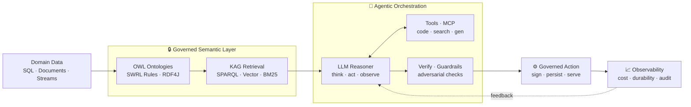

<!-- ===================== HERO ===================== -->

<b>I design governed, production-grade AI systems on mission-critical infrastructure.</b>

  
  
  
  
  

---

## 🧭 Where I Stand

I sit where **data science meets enterprise architecture**. I don't just train models — I architect the **governed systems** that put them into production *where failure is not an option*. A decade shipping **fiscal & banking infrastructure** — software audited by ministries and trusted by thousands of banks — taught me what "production-grade" actually costs. I bring that same discipline to AI: **observability, idempotency, durability, and governance**, applied to LLMs and semantic reasoning.

> **My edge:** most people can train a model *or* ship a system. I do both — and I make the model *behave* inside the system.

---

## 🏛️ Enterprise AI Architecture

I build **agentic, knowledge-grounded AI** that operates inside a governed semantic world — not a chatbot, an **architecture**:

| Capability | What I architect |
|---|---|
| **Agentic orchestration** | Multi-agent think/act/observe loops, tool-use, MCP servers, parallel dispatch, self-correction bounds |
| **KAG — Knowledge-Augmented Generation** | LLMs reasoning *inside* OWL/SWRL/RDF4J ontologies — contextual retrieval (SPARQL + vector + BM25), not naive RAG |
| **LLMOps** | Multi-provider routing, prefix/KV caching, cost metering, streaming, durable task recovery |
| **Model serving** | PMML / JPMML portability — train in Python, serve in Java at enterprise scale |
| **Governance & trust** | Adversarial verification, guardrails, tamper-proof audit trails, XAdES/PKCS#11 digital signatures |
| **Production discipline** | Idempotency anchors, single-source-of-truth state, observability, zero-failure SLAs |

---

## 🏆 Flagship — ODS · Temenos-Certified Distribution (3,000+ Banks)

> The system I'm proudest of is one most people will never see — because it simply **never fails**.

**Scale & status.** A **Temenos Exchange–certified** Operational Data Store, deployed across **3,000+ banks worldwide** and featured on temenos.com. Production-hardened; zero critical failures across its production life.

**The problem.** Every bank generates massive **Close-of-Business (COB)** volumes at midnight. They must fan out — reconciled and complete — to **Data-Warehouse, HR, and Audit** systems with **guaranteed delivery before 08:00**. The window is fixed; the tolerance is zero.

**Why it's hard** ⚙️ A fixed overnight window, massive volume, **zero tolerance** — in banking a missed or duplicated batch is a *compliance event*, not an inconvenience. The data has to arrive **reconciled, complete, and on time**, every single night.

**What it represents.** Zero-failure reliability engineering at financial-sector scale — the discipline I carry into every AI system I build.

`Java` · `Spring Boot` · `Redis` · `gRPC` · `Oracle` · `Grafana` · `Linux` &nbsp;|&nbsp; 🔒 *Proprietary production system — described faithfully, at a non-disclosing altitude (no internal design disclosed).*

---

## 🔬 Applied Data Science & ML

Hands-on, end-to-end — from raw signal to served decision:

- **Computer Vision / OCR** — Arabic document OCR pipelines (deskew sweeps, glare/label removal, multi-engine fallback) on real Tunisian ID & fiscal documents.
- **NLP / NLU** — NER + fuzzy entity resolution, semantic invoice checkers, intent classification across **EN / FR / Tunisian**.
- **Classical ML** — risk scoring (credit default, tax-risk), feature selection (RFE/RFECV), dimensionality reduction, cross-validated model selection.
- **Semantic AI** — ontology-driven **fraud detection** with SPARQL + SHACL over knowledge graphs.

📊 Deep-dive ML / DS portfolio → <a href="https://github.com/MuhamedHabib">@MuhamedHabib</a>

---

## 📌 What I Have Delivered

> No placeholder projects — everything below runs in **production**.

| Project | What it is | Stack |
|---|---|---|
| **ODS** — *Temenos Exchange Certified* | Distributes massive midnight COB volumes across DW / HR / Audit systems for **3,000+ banks** — guaranteed delivery before 08:00, zero failures. Featured on temenos.com. | `Java` · `Spring Boot` · `Redis` · `gRPC` · `Oracle` |
| **PMIS Madagascar** — *World Bank* | Full-stack government platform, Ministry of Energy & Hydrocarbons — conception → production. | `Java 21` · `Spring Boot 3` · `Angular 17` · `Spring Batch` · `Docker` |
| **Fiscal POS** — *Ministry-Homologated* | Cash-register system certified by the Ministry of Finance, **5,000+ stations**, tamper-proof audit trail, zero critical failure. | `XAdES` · `PKCS#11` · `Remote Agent/Client` |
| **Fatoora Hub** *(active)* | End-to-end El&nbsp;Fatoura e-invoicing: draft → sign → submit → accept. | `XAdES` · `TunTrust` · `Spring Boot 3` |
| **✦ MCP Orchestration Research** *(active)* | Multi-agent pipelines where LLMs operate inside **governed semantic worlds** (OWL + SWRL + RDF4J). | `Claude AI` · `MCP` · `KAG` · `SPARQL` |

---

## 🛠️ Arsenal

**AI · ML · Data**

  
  
  
  
  
  
  

**Agentic & Semantic AI**

  
  
  
  
  
  
  

**Enterprise Backend & Platform**

  
  
  
  
  
  
  
  

**Cloud & DevOps**

  
  
  
  
  

---

## 📊 GitHub Analytics

> 🏆 Pair Extraordinaire ×3 · Pull Shark ×3 · YOLO · Quickdraw &nbsp;|&nbsp; 🌍 **GSoC 2026** — Accord Project (Linux Foundation): agentic workflow + LLM template-logic executor.

---

## 💡 The Case, Plainly

**I worked before AI — and with AI.** That dual lens is my speed *and* my depth.
I don't arrive alone at a mission; I arrive with an **amplification capability** —
orchestrated agentic systems that deliver in **one day** what a team handles in a week,
**without trading away** the governance, audit, and zero-failure discipline an enterprise demands.

 

### 📬 Let's architect something that ships — and holds.

**Available — Remote · On-site · Relocation (France)**

